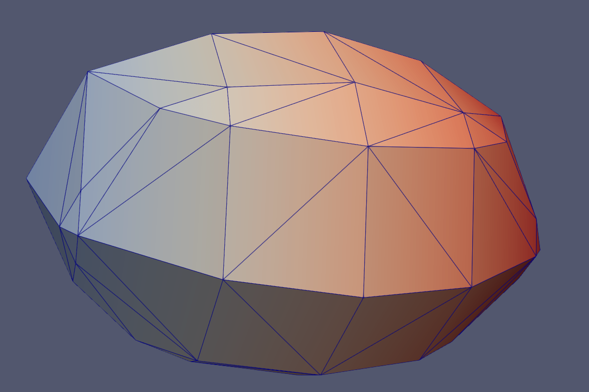

# Run

```
$ make
nvcc -O2 -g -Xcompiler '' iso.cu -o iso
```

or
```
$ make 'NVCCFLAGS = -arch=native' -B
nvcc -arch=native -Xcompiler '' iso.cu -o iso
```

Generate input data. For one level mesh.

```
$ python gen.py
gen.py: in.cell in.scalar in.field
$ ./iso -v in.cells in.scalar in.field 0 mesh
iso: ncell, maxlevel, origin: 1000 0 [0 0 0]
iso: ntri: 128
iso: nvert: 66
```



For multiresoltuon mesh:

```
$ python gen2.py
gen2.py: write in.cell in.scalar in.field
$ ./iso -v in.cells in.scalar in.field 0 mesh2
iso: ncell, maxlevel, origin: 7792 4 [0 0 0]
iso: ntri: 6460
iso: nvert: 3232
```

Usage message
```
$ ./iso -h
Usage: iso [-v] [-s X0 Y0 Z0 L minlevel] in.cells in.scalar in.field iso mesh

Example:
  iso -v data.cells data.scalar data.field 0.5 output

Arguments:
  in.cells   Binary file describing the AMR cell structure.
  in.scalar  Binary file with scalar field values.
  in.field   Binary file with additional field values.
  iso        Iso-surface value to extract (e.g., 0.5).
  mesh       Output file name prefix for generated mesh.

Options:
  -s         Domain center, size, and minimum level for rescaling
  -v         Enable verbose output.
  -h         Show this help message and exit.
```

Run on FAS RC
```
srun -p gpu_test --gpus 1 --mem 2Gb ./iso -v in.cells in.scalar in.field 0 mesh
```

# Reference

Sample code for our CUDA AMR Dual-Mesh Generation / Iso-Surface
Extraction Paper

Wald, Ingo. "A simple, general, and GPU friendly method for computing
dual mesh and iso-surfaces of adaptive mesh refinement (AMR) data."
arXiv preprint arXiv:2004.08475 (2020).
<https://arxiv.org/abs/2004.08475>
