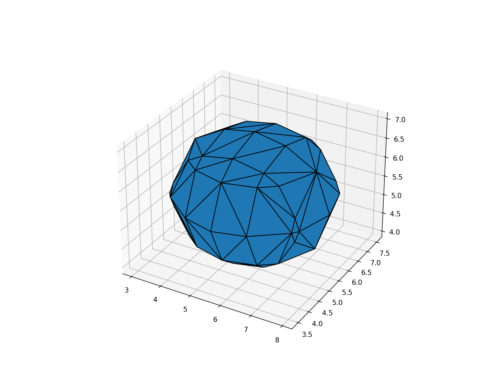
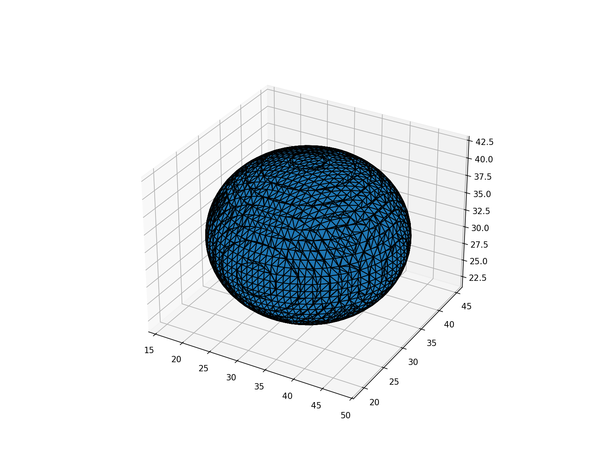
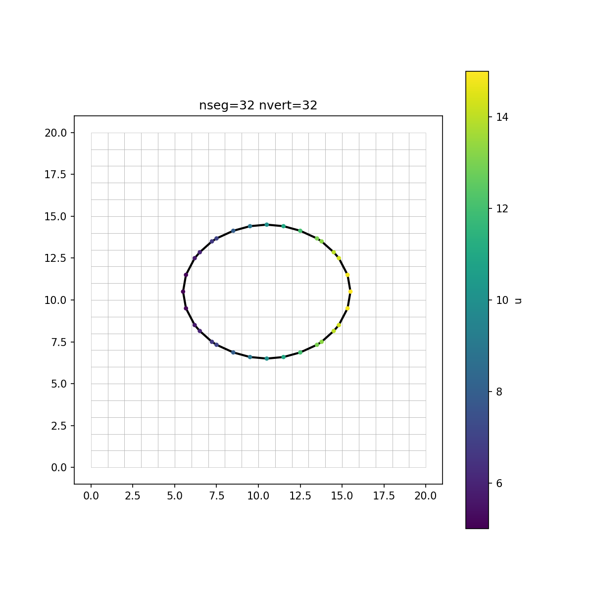
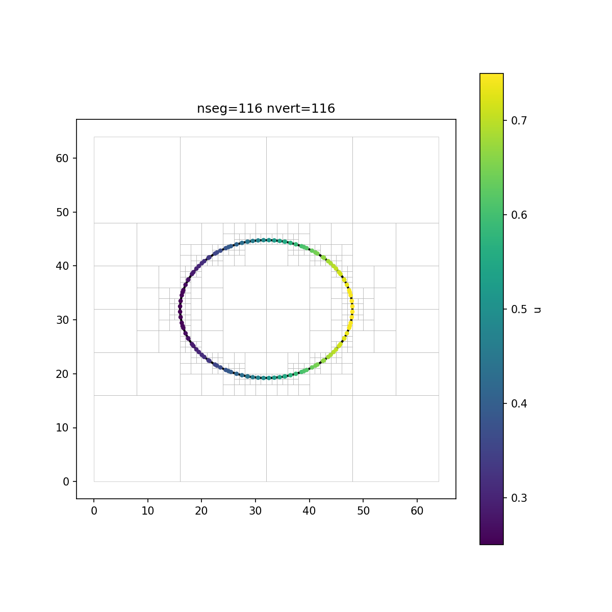

## Build

CUDA (requires `nvcc`):
```
$ make iso
```

CPU-only (C99, no dependencies):
```
$ make iso-cpu
$ make cube
```

## 3D Iso-Surface Extraction

Generate uniform grid data and extract iso-surface:
```
$ python gen3d.py
gen3d.py: write in.cells in.scalar in.field
$ ./iso -v in.cells in.scalar in.field 0 mesh
iso: ncell, maxlevel, origin: 1000 0 [0 0 0]
iso: ntri: 128
iso: nvert: 66
$ python view3d.py mesh
```


Multi-resolution AMR mesh:
```
$ python gen3d-amr.py
gen3d-amr.py: write in.cells in.scalar in.field
$ ./iso -v in.cells in.scalar in.field 0 mesh-amr
iso: ncell, maxlevel, origin: 7792 4 [0 0 0]
iso: ntri: 6460
iso: nvert: 3232
$ python view3d.py mesh-amr
```


## 2D Iso-Line Extraction

Generate uniform grid data and extract iso-line:
```
$ python gen2d.py
gen2d.py: write in.cells in.scalar in.field
$ ./cube -v in.cells in.scalar in.field 0 mesh2d
cube: ncell, maxlevel, origin: 400 0 [0 0]
cube: nseg: 32
cube: nvert: 32
$ python view2d.py mesh2d in.cells
```


Multi-resolution AMR mesh:
```
$ python gen2d-amr.py
gen2d-amr.py: write in.cells in.scalar in.field
$ ./cube -v in.cells in.scalar in.field 0 mesh2d-amr
cube: ncell, maxlevel, origin: 364 4 [0 0]
cube: nseg: 116
cube: nvert: 116
$ python view2d.py mesh2d-amr in.cells
```


## Usage

```
$ ./iso -h
Usage: iso [-v] [-s X0 Y0 Z0 L minlevel] in.cells in.scalar in.field iso mesh

Arguments:
  in.cells   Binary file describing the AMR cell structure.
  in.scalar  Binary file with scalar field values.
  in.field   Binary file with additional field values.
  iso        Iso-surface value to extract (e.g., 0.5).
  mesh       Output file name prefix for generated mesh.

Options:
  -s         Domain center, size, and minimum level for rescaling
  -v         Enable verbose output.
  -h         Show this help message and exit.
```

```
$ ./cube -h
Usage: cube [-v] [-s X0 Y0 L minlevel] in.cells in.scalar in.field iso mesh

Arguments:
  in.cells   Binary file describing the 2D AMR cell structure.
  in.scalar  Binary file with scalar field values.
  in.field   Binary file with additional field values.
  iso        Iso-line value to extract (e.g., 0.5).
  mesh       Output file name prefix for generated mesh.

Options:
  -s         Domain center, size, and minimum level for rescaling
  -v         Enable verbose output.
  -h         Show this help message and exit.
```

## Files

| File | Description |
|------|-------------|
| [iso.cu](iso.cu) | 3D iso-surface extraction (CUDA) |
| [iso.c](iso.c) | 3D iso-surface extraction (C99) |
| [cube.c](cube.c) | 2D iso-line extraction (C99) |
| [table.inc](table.inc) | Marching cubes lookup table |
| [gen3d.py](gen3d.py) | Generate uniform 3D test data |
| [gen3d-amr.py](gen3d-amr.py) | Generate multi-resolution 3D AMR test data |
| [gen2d.py](gen2d.py) | Generate uniform 2D test data |
| [gen2d-amr.py](gen2d-amr.py) | Generate multi-resolution 2D AMR test data |
| [view3d.py](view3d.py) | Visualize 3D iso-surface (requires meshio, matplotlib) |
| [view2d.py](view2d.py) | Visualize 2D iso-line (requires matplotlib, numpy) |

## Reference

Wald, Ingo. "A simple, general, and GPU friendly method for computing
dual mesh and iso-surfaces of adaptive mesh refinement (AMR) data."
arXiv preprint arXiv:2004.08475 (2020).
<https://arxiv.org/abs/2004.08475>
