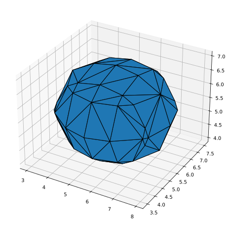
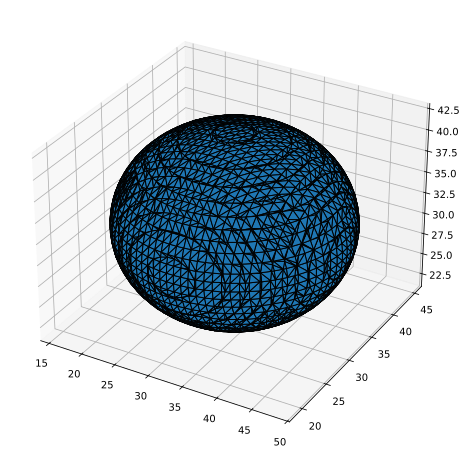
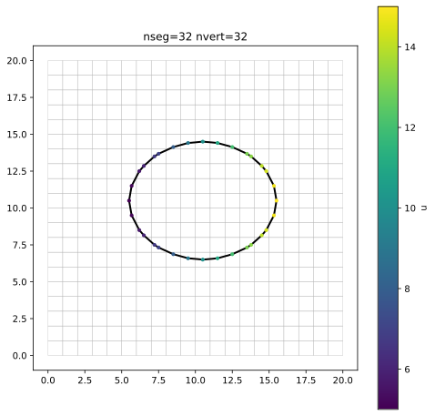
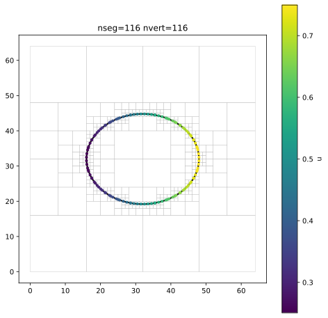
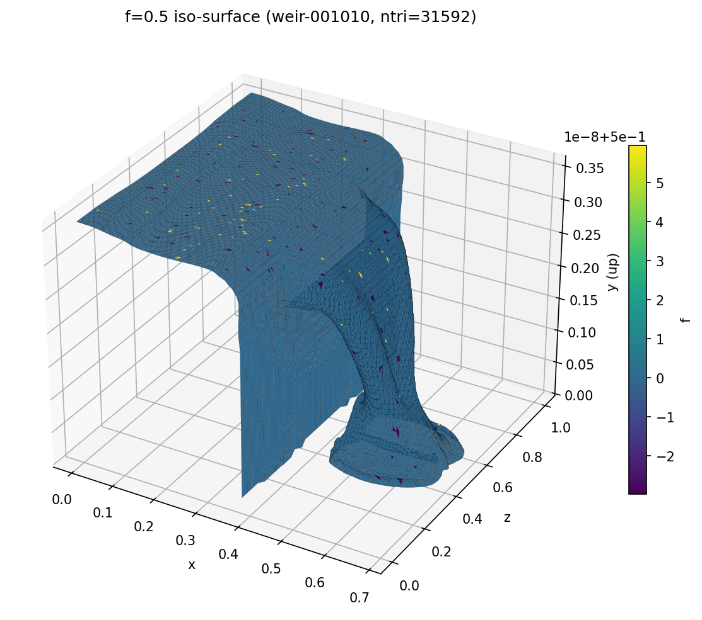
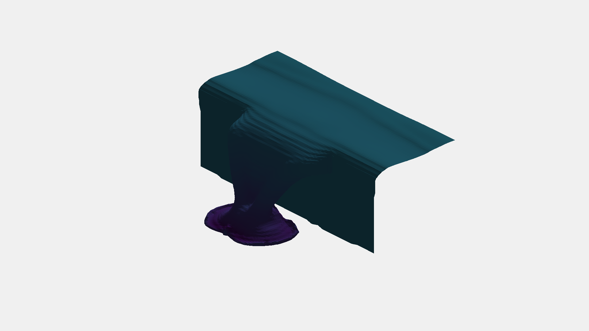

# amriso

Iso-surface (3D) and iso-line (2D) extraction for adaptive mesh
refinement (AMR) data with cell-centered fields.

Uses the dual-mesh method from Wald (2020): each AMR cell center
becomes a vertex of the dual mesh, and marching cubes (3D) or
marching squares (2D) operates on the dual cells formed by groups
of adjacent cell centers. Cell lookup is by Morton-code sorted
binary search. This handles grids with arbitrary levels of
refinement without stitching or special treatment of level
boundaries.

Available as C command-line tools, a CUDA kernel, and a Python C
extension (`amriso`) with optional OpenMP parallelism and a
zero-allocation mode for repeated calls.

## Build

CUDA (requires `nvcc`):
```
$ make iso
```

CPU-only (C99, no dependencies):
```
$ make iso-cpu
$ make cube
$ make iso2d
$ make iso3d
```

## 3D Iso-Surface Extraction

Generate uniform grid data and extract iso-surface:
```
$ python gen3d.py
gen3d.py: write in.cells in.scalar in.field
$ ./iso -v in.cells in.scalar in.field 0 mesh
iso: ncell, maxlevel, origin: 1000 0 [0 0 0]
iso: ntri: 128
iso: nvert: 66
$ python view3d.py mesh
```


Multi-resolution AMR mesh:
```
$ python gen3d-amr.py
gen3d-amr.py: write in.cells in.scalar in.field
$ ./iso -v in.cells in.scalar in.field 0 mesh-amr
iso: ncell, maxlevel, origin: 7792 4 [0 0 0]
iso: ntri: 6460
iso: nvert: 3232
$ python view3d.py mesh-amr
```


## 2D Iso-Line Extraction

Generate uniform grid data and extract iso-line:
```
$ python gen2d.py
gen2d.py: write in.cells in.scalar in.field
$ ./cube -v in.cells in.scalar in.field 0 mesh2d
cube: ncell, maxlevel, origin: 400 0 [0 0]
cube: nseg: 32
cube: nvert: 32
$ python view2d.py mesh2d in.cells
```


Multi-resolution AMR mesh:
```
$ python gen2d-amr.py
gen2d-amr.py: write in.cells in.scalar in.field
$ ./cube -v in.cells in.scalar in.field 0 mesh2d-amr
cube: ncell, maxlevel, origin: 364 4 [0 0]
cube: nseg: 116
cube: nvert: 116
$ python view2d.py mesh2d-amr in.cells
```


## Extraction from Raw Binary Dumps

`iso3d` and `iso2d` read raw binary files directly and extract
iso-surfaces or iso-lines. The number of cells is inferred from the
geometry file size. Field precision (float or double) is detected
automatically.

For simple one-value-per-cell files:
```
$ ./iso3d -v dump.xyz.raw dump.rho.raw dump.rho.raw 0.5 iso
$ ./iso2d -v dump.xy.raw dump.rho.raw dump.rho.raw 0.5 iso
```

For interleaved fields (multiple values per cell in one file), use
`file:offset:stride`:
```
$ ./iso3d -v dump.xyz.raw dump.attr.raw:0:6 dump.attr.raw:0:6 0.5 iso
$ python viewtri.py iso
```

## Usage

```
$ ./iso -h
Usage: iso [-v] [-s X0 Y0 Z0 L minlevel] in.cells in.scalar in.field iso mesh

Arguments:
  in.cells   Binary file describing the AMR cell structure.
  in.scalar  Binary file with scalar field values.
  in.field   Binary file with additional field values.
  iso        Iso-surface value to extract (e.g., 0.5).
  mesh       Output file name prefix for generated mesh.

Options:
  -s         Domain center, size, and minimum level for rescaling
  -v         Enable verbose output.
  -h         Show this help message and exit.
```

```
$ ./cube -h
Usage: cube [-v] [-s X0 Y0 L minlevel] in.cells in.scalar in.field iso mesh

Arguments:
  in.cells   Binary file describing the 2D AMR cell structure.
  in.scalar  Binary file with scalar field values.
  in.field   Binary file with additional field values.
  iso        Iso-line value to extract (e.g., 0.5).
  mesh       Output file name prefix for generated mesh.

Options:
  -s         Domain center, size, and minimum level for rescaling
  -v         Enable verbose output.
  -h         Show this help message and exit.
```

```
$ ./iso3d -h
Usage: iso3d [-v] coords.raw scalar.raw field.raw level output

Extract 3D iso-surfaces from raw binary files.

Arguments:
  coords.raw  Hexahedron vertices, float[ncell][8][3].
  scalar.raw  Cell-centered scalar field (float or double).
  field.raw   Cell-centered field to interpolate.
  level       Iso-value.
  output      Output file name prefix.
```

```
$ ./iso2d -h
Usage: iso2d [-v] coords.raw scalar.raw field.raw level output

Extract 2D iso-lines from raw binary files.

Arguments:
  coords.raw  Quadrilateral vertices, float[ncell][4][2].
  scalar.raw  Cell-centered scalar field (float or double).
  field.raw   Cell-centered field to interpolate.
  level       Iso-value.
  output      Output file name prefix.
```

## Python Package (amriso)

Build:
```
$ pip install -e .
```

2D iso-lines:
```python
import amriso

coords, scalar = amriso.example2d()
xy, seg, attr = amriso.extract2d(coords, scalar, scalar, 0.0)
```

3D iso-surfaces:
```python
coords, scalar = amriso.example3d()
xyz, tri, attr = amriso.extract3d(coords, scalar, scalar, 0.0)
```

Zero-allocation mode (for repeated calls):
```python
import numpy as np

ncell = len(scalar)
nmax = 4 * ncell
work = np.empty(amriso.workspace_size2d(ncell), dtype=np.uint8)
xy = np.empty((nmax, 2), dtype=np.float32)
seg = np.empty((nmax, 2), dtype=np.int32)
attr = np.empty(nmax, dtype=np.float32)
for scalar in time_series:
    nseg, nvert = amriso.extract2d(
        coords, scalar, scalar, 0.5,
        out=(xy, seg, attr), work=work)
```

Reading raw binary dumps (2D):
```python
geo = np.fromfile('dump.xy.raw', dtype=np.float32)
rho = np.fromfile('dump.rho.raw', dtype=np.float64).astype(np.float32)
xy, seg, attr = amriso.extract2d(geo, rho, rho, 2.0)
```

Reading raw binary dumps (3D, interleaved fields).
The [assets/](assets/) directory contains example data from a
sharp-crested weir simulation (Hexahedron topology, 6 floats per cell:
`f`, `p`, `cs`, `ux`, `uy`, `uz`):
```python
import numpy as np, amriso
import matplotlib.pyplot as plt
from mpl_toolkits.mplot3d.art3d import Poly3DCollection

geo = np.fromfile('assets/weir-001010.xyz.raw', dtype=np.float32)
attr_raw = np.fromfile('assets/weir-001010.attr.raw', dtype=np.float32)
ncell = len(attr_raw) // 6
f = attr_raw.reshape(ncell, 6)[:, 0].copy()

xyz, tri, attr = amriso.extract3d(geo, f, f, 0.5)
amriso.dump3d('assets/weir-001010-iso', xyz, tri, attr)

xs = xyz[:, [0, 2, 1]]
fig = plt.figure(figsize=(10, 8))
ax = fig.add_subplot(111, projection='3d')
poly = Poly3DCollection(xs[tri], facecolor='steelblue',
                        edgecolor='k', linewidth=0.05)
ax.add_collection3d(poly)
ax.auto_scale_xyz(xs[:, 0], xs[:, 1], xs[:, 2])
ax.set_xlabel('x'); ax.set_ylabel('z'); ax.set_zlabel('y (up)')
plt.savefig('weir.png', dpi=150, bbox_inches='tight')

amriso.dump3d('weir-iso', xyz, tri, attr)
```

The `dump3d` call writes `weir-iso.xdmf2`, `weir-iso.xyz.raw`,
`weir-iso.tri.raw`, and `weir-iso.attr.raw` for viewing in ParaView.



Software rasterizer:
```
$ ./iso3d -v assets/weir-001010.xyz.raw assets/weir-001010.attr.raw:0:6 assets/weir-001010.attr.raw:1:6 0.5 iso
$ ./render -s 1920x1080 -u y -e 25 -a 220 iso render.png
```



## Files

| File | Description |
|------|-------------|
| [iso.cu](iso.cu) | 3D iso-surface extraction (CUDA) |
| [iso.c](iso.c) | 3D iso-surface extraction (C99) |
| [cube.c](cube.c) | 2D iso-line extraction (C99) |
| [iso3d.c](iso3d.c) | 3D iso-surface from raw binary dumps (C99) |
| [iso2d.c](iso2d.c) | 2D iso-line from raw binary dumps (C99) |
| [table.inc](table.inc) | Marching cubes lookup table |
| [gen3d.py](gen3d.py) | Generate uniform 3D test data |
| [gen3d-amr.py](gen3d-amr.py) | Generate multi-resolution 3D AMR test data |
| [gen2d.py](gen2d.py) | Generate uniform 2D test data |
| [gen2d-amr.py](gen2d-amr.py) | Generate multi-resolution 2D AMR test data |
| [viewtri.py](viewtri.py) | Plot triangle mesh from raw binary (requires matplotlib, numpy) |
| [view3d.py](view3d.py) | Visualize 3D iso-surface via XDMF2 (requires meshio, matplotlib) |
| [view2d.py](view2d.py) | Visualize 2D iso-line (requires matplotlib, numpy) |
| [render.c](render.c) | Software rasterizer for triangle meshes (C99) |
| [stb_image_write.h](stb_image_write.h) | PNG writer (vendored, public domain) |
| [amriso.c](amriso.c) | Python C extension (2D + 3D) |
| [pyproject.toml](pyproject.toml) | Python package metadata |
| [setup.py](setup.py) | Build script for amriso |
| [run.sh](run.sh) | Rebuild everything and process output data |

## Reference

Wald, Ingo. "A simple, general, and GPU friendly method for computing
dual mesh and iso-surfaces of adaptive mesh refinement (AMR) data."
arXiv preprint arXiv:2004.08475 (2020).
<https://arxiv.org/abs/2004.08475>
